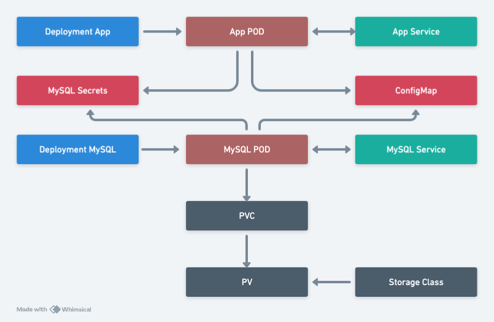

# BankApp — Java Spring Boot Banking Application

## Overview

BankApp is a containerized Spring Boot banking application designed for deployment on Kubernetes using Infrastructure-as-Code (Terraform) principles. The project demonstrates best practices in microservice architecture, database persistence, and cloud-native deployments.

**Key Features:**
- Spring Boot 3 with Spring Data JPA and Spring Security
- Thymeleaf templating engine for server-side rendering
- MySQL database with persistent storage
- Docker containerization and Kubernetes orchestration
- Infrastructure automation via Terraform and Kubernetes manifests

---

## Architecture

### System Components

The application follows a cloud-native architecture with the following layers:



### Kubernetes Deployment Architecture

The application is deployed across the following Kubernetes resources:

**Application Tier:**
- **Deployment (App)** — Manages BankApp Spring Boot Pod replicas with rolling updates
- **Service (App)** — Internal ClusterIP service exposing the app on port 8080
- **ConfigMap** — Non-sensitive application configuration
- **Secrets** — MySQL credentials and sensitive configuration data

**Database Tier:**
- **Deployment (MySQL)** — Manages MySQL Pod with replicas
- **Service (MySQL)** — Internal ClusterIP service for database connectivity (DNS: `mysql-service`)
- **PersistentVolumeClaim (PVC)** — Storage request for MySQL data persistence
- **PersistentVolume (PV)** — Backing storage provisioned by StorageClass
- **StorageClass** — Defines storage provisioning rules and performance characteristics


### Local Development

#### 1. Build the Application

```bash
mvn clean package
```

#### 2. Configure Database

Create a MySQL database and ensure credentials match those in [bankapp-java/src/main/resources/application.properties](bankapp-java/src/main/resources/application.properties):

```properties
spring.datasource.url=jdbc:mysql://localhost:3306/bankappdb
spring.datasource.username=root
spring.datasource.password=root
```

#### 3. Run the Application

**Run packaged JAR**
```bash
java -jar bankapp-java/target/bankapp-0.0.1-SNAPSHOT.jar
```

Access the application at: `http://localhost:8080/login`

---

## Docker Deployment

### Build Container Image

```bash
docker build -t bankapp-java:latest -f bankapp-java/Dockerfile .
```

### Run Container

```bash
docker run -p 8080:8080 bankapp-java:latest
```

---

## Kubernetes Deployment

### Prerequisites

- Kubernetes cluster running
- `kubectl` configured
- Container registry (Docker Hub, ECR, etc.)

### Deploy to Kubernetes

#### 1. Push image to registry

```bash
docker tag bankapp-java:latest <registry>/bankapp-java:latest
docker push <registry>/bankapp-java:latest
```

#### 2. Create namespace (optional)

```bash
kubectl create namespace bankapp
```

#### 3. Apply Kubernetes manifests

```bash
kubectl apply -f manifest-code/manifest.yaml -n bankapp
```

#### 4. Verify deployment

```bash
kubectl get pods,svc -n bankapp
kubectl logs -f deployment/bankapp -n bankapp
```

---

## Infrastructure as Code (Terraform)

This project includes Terraform code for automated infrastructure provisioning.

### Configuration Files

| File | Purpose |
|------|---------|
| [terraform-code/main.tf](terraform-code/main.tf) | Primary resource definitions |
| [terraform-code/variables.tf](terraform-code/variables.tf) | Input variables |
| [terraform-code/output.tf](terraform-code/output.tf) | Output values |

### Deploy Infrastructure

```bash
cd terraform-code
terraform init
terraform plan
terraform apply
```

